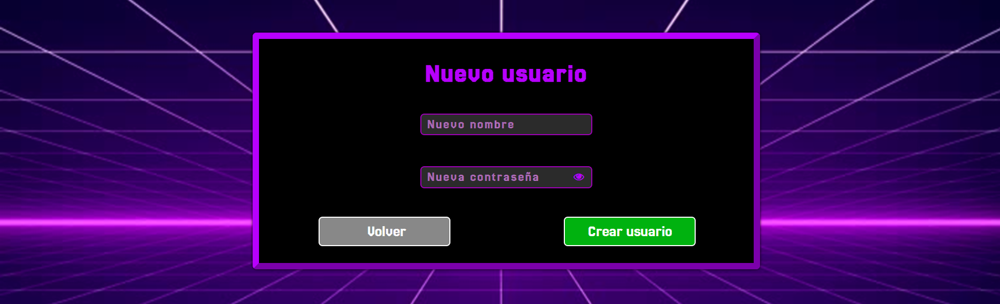
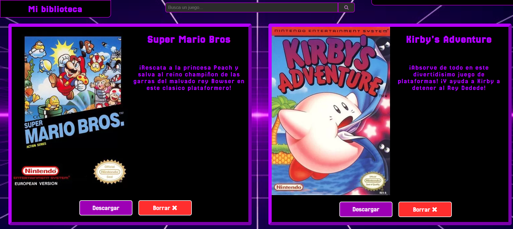
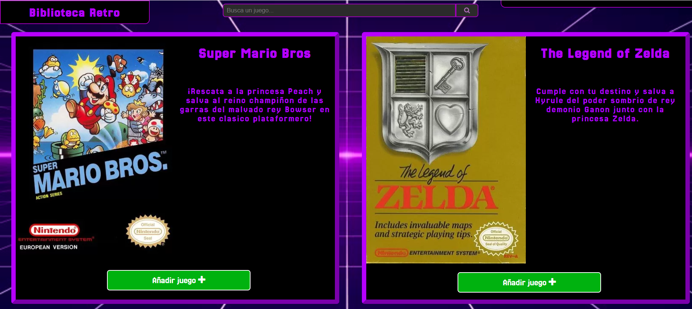

<h1>Biblioteca de juegos retro</h1>
<h2>Proyecto DWESE 2024-2025  Hecho por Miguel Ángel Ávila Rosas, 2ºDAW (Mañana)</h2>

<h3>Explicación de funcionamiento</h3>

En esta aplicación, pondremos en disposicion del usuario una biblioteca donde podra almacenar y descargar juegos Retro, pudiendo sacar estos de una biblioteca general con todos los juegos almacenados en la base de datos, tambien dandole la opcion al usuario de poder borrar los juegos que ya no quiera de su lista.

<h3>Secciones de la pagina</h3>

<h4>Registro del usuario (index.php)</h4>

En esta sección se le pedira al usuario que se registre dentro de la pagina, utilizando para ello su nombre de usuario y contraseña. Si el usuario introduce los datos incorrectamente, se le dara un mesaje indicando que el usuario o la contraseña son inconrrectas. En caso de que el usuario se registre correctamente, sera enviado a su biblioteca personal.  En caso de que el usuario no se haya creado una cuenta anteriormente, tiene la opción de crear una, la cual le llevara a la sección de introducir un usuario.

<h4>Creación de usuario (newUser.php)</h4>

En esta sección se le dara al usuario la opcion de crearse una cuenta en la pagina, para ello tendra que introducir el nombre y la contraseña de su nuevo usuario. Si el nombre del usuario ya esta asignado a otro usuario en la base de datos, se le dara un mensaje al usuario indicando que elija otro nombre. En caso de que el usuario cree su cuenta correctamente, sera enviado de nuevo al registro para introducir sus datos una ultima vez para loguearse.

<h4>Pagina principal (mainPage.php)</h4>

En esta sección se encontrara la bilioteca del usuario, en la cual estaran todos los juegos que haya añadido a esta. En la parte superior, habra una barra de navegacióm, con la cual el usuario podra indicar que juegos de du blioteca quiere buscar, en caso de que el juego que busca no existe le aparecera un mensaje indicando que no se encontro el titulo. La pagina mostrara todos los juegos que contengan en alguna parte de su titulo, busqueda realizada por el usuario. Ademas en las esquinas de la pagina habra información sobre la pagina en la que estas y el usuario con el que estas conectado, dandote la opcion de poder borrar tu usuario si quieres.  Ademas, al final de la pagina el usuario tendra la opcion añadir nuevos juegos a su biblioteca o cerrar sesion, lo que le devolvera a la pagina de Login.

<h4>Biblioteca retro (gamePage.php)</h4>

En esta ultima sección, se econtrara la biblioteca completa de juegos retro que haya en la base de datos. Aqui el usuario tendra la opción de añadir individualmente cada juego que quiera, lo cual se mostrara en su pagina de usuario. Por lo demas, esta pagina es muy similar a la biblioteca del usuario, pero con la opción de poder añadir los juegos, en vez de descargarlos.

