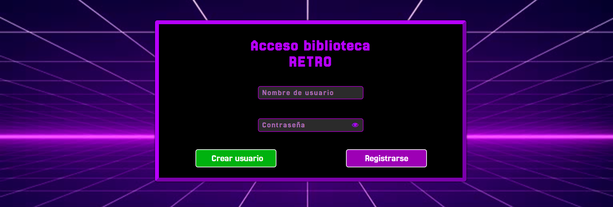

<h1>Biblioteca de juegos retro</h1>
<h2>Proyecto DWESE 2024-2025  Hecho por Miguel Ángel Ávila Rosas, 2ºDAW (Mañana)</h2>

<h3>Explicación de funcionamiento</h3>

En esta aplicación, pondremos en disposicion del usuario una biblioteca donde podra almacenar y descargar juegos Retro, pudiendo sacar estos de una biblioteca general con todos los juegos almacenados en la base de datos, tambien dandole la opcion al usuario de poder borrar los juegos que ya no quiera de su lista.

<h3>Secciones de la pagina</h3>

<h4>Index</h4>

En esta sección se le pedira al usuario que se registre dentro de la pagina, utilizando para ello su nombre de usuario y contraseña. Si el usuario introduce los datos incorrectamente, se le dara un mesaje indicando que el usuario o la contraseña son inconrrectas. En caso de que el usuario se registre correctamente, sera enviado a su biblioteca personal.  En caso de que el usuario no se haya creado una cuenta anteriormente, tiene la opción de crear una, la cual le llevara a la sección de introducir un usuario.

